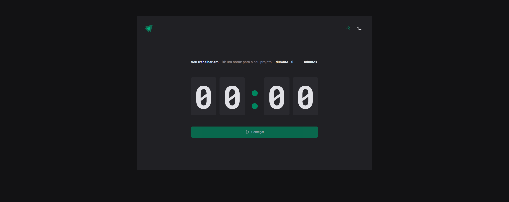
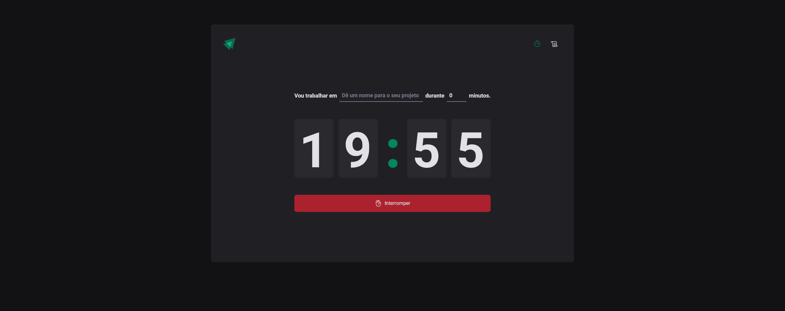
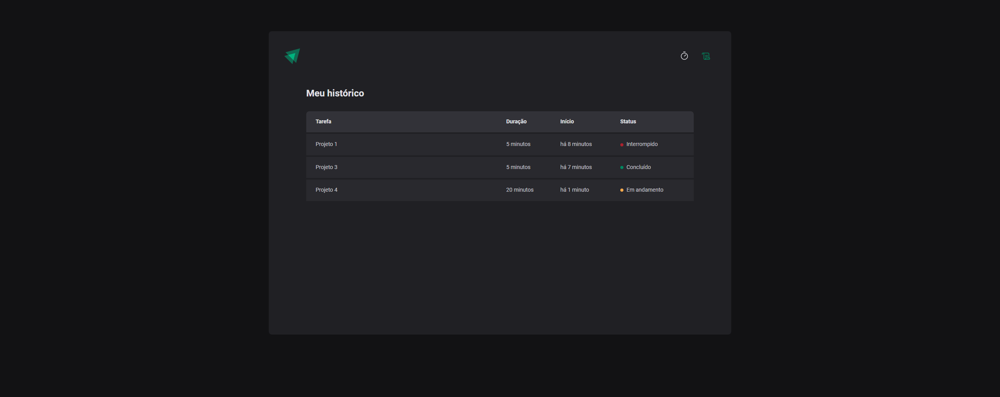

# Ignite Timer

### Important Skills:
<ul>
  <li>React</li>
  <li>Styled-Components</li>
  <li>useReducer from React</li>
  <li>Layout component shared</li>
  <li>Themes with Styled-Components</li>
</ul>

### Home

  

### Iniciando novo ciclo

  

### Listagem de ciclos

  

